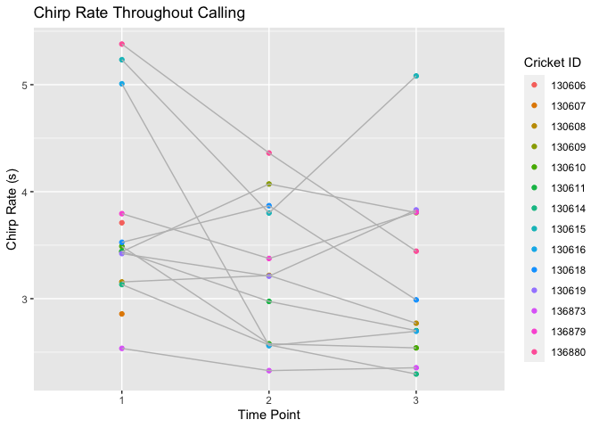

An Analysis of Cricket Chirps
================

``` r
library(tidyverse)
```

    ## ── Attaching packages ─────────────────────────────────────── tidyverse 1.3.1 ──

    ## ✓ ggplot2 3.3.5     ✓ purrr   0.3.4
    ## ✓ tibble  3.1.4     ✓ dplyr   1.0.7
    ## ✓ tidyr   1.1.3     ✓ stringr 1.4.0
    ## ✓ readr   2.0.2     ✓ forcats 0.5.1

    ## ── Conflicts ────────────────────────────────────────── tidyverse_conflicts() ──
    ## x dplyr::filter() masks stats::filter()
    ## x dplyr::lag()    masks stats::lag()

``` r
crickets3 <- read_csv("crickets3.csv")
```

    ## Rows: 38 Columns: 3

    ## ── Column specification ────────────────────────────────────────────────────────
    ## Delimiter: ","
    ## dbl (3): cricket_id, chirp_rate, time_point

    ## 
    ## ℹ Use `spec()` to retrieve the full column specification for this data.
    ## ℹ Specify the column types or set `show_col_types = FALSE` to quiet this message.

\#Does the rate at which crickets chirp change throughout their call?

``` r
ggplot(data = crickets3, mapping = aes(x = factor(time_point), y = chirp_rate, color = factor(cricket_id))) +
  geom_point() +
  geom_line(aes(group = cricket_id),color="grey") +
  labs(title = "Chirp Rate Throughout Calling", x = "Time Point", y = "Chirp Rate (s)", color = "Cricket ID")
```

<!-- -->
